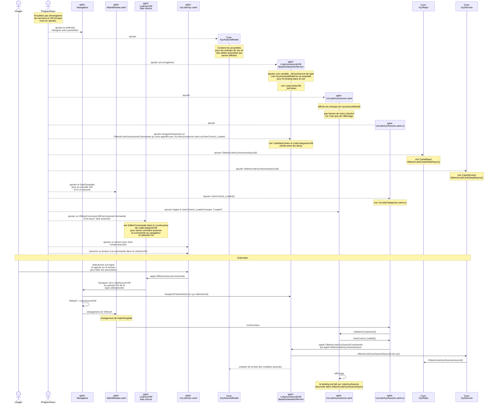

# Aide pour le TP3

Pour le TP3, vous devez *faire l'affichage* d'une entité (genre, artiste maisonedition) afin de sélectionner une ligne, ce qui affichera les informations associées à cette ligne.

La technique pour faire ca n'a pas été directement expliqué dans le cours, mais elle dérive de plusieurs techniques que nous avons vues. 

Le diagramme ci-dessous vous donne, en premier lieu, les étapes de programmation à suivre. Par la suite, vous y trouverez les étapes d'exécution de ce code. 

Bonne lecture!

Pour voir ce diagramme plus gros sur [Kroki!](https://kroki.io/mermaid/svg/eNqlV9tuGzcQffdXDAIEloDaQfsopAIcOwUCRKmRxE7eBGp3LLPdJTckV5b9NX2MvkM_1hlyb6Io2UX9Yonk3M6cucjijxpVhldSLI0oT16_hqvtZoWFriosUbmTE6A_kTltoLZoQFi4sWKJZnBRGb3ki2v6T1pKrMOt0g5BrzC8mHw61fWikPgEFT3OT1EZXErrDJq3CzMt0AJZWMmMPqCD2xkU2lhykG9XuqZTBeIvXTt8OgfwJiphnMxkJZSDh-pursRKel--Xf8xYblPfCBc61L8vhRSPUiV64f5WpTFUHJGV9_81TlfBXGK4-xsOu1MTYI_BgoB5Xbj7nWO0NmtGbAVZmxWlNufFGrSi4JQwC-6NhlS1AMfPvLF98en25lHiL-B9e-Seurs170wbrJWSQjDC2YGCZMd-UwbnNOrC2t1JnFGgXg9l3TuFUV3O3ikhDtoIi4k315q5STxDZgFpLUyktDcbixbrihif5Hdi7Ii6iCQPHGEL3M6d2LB18Jr3G7o449a8iXxiRSDuLuT2T1pOxR8l4TGqXQWLhr9IRuTd8LiNScWKa90JpWb7rFkV2uHyYgIPuD_OMLoiGStEFbCSA4Z5oV1PZQMjHusfL0AO_02gnlKVq0Y4juAFxZEdqmWkAtlmc-rGp93a6Wl8bbwkvBEG7Bhv8L3Y4jX2W9H6NrYSBdfK9rCknC0f-Kzj_sM2qPzAQXcrhZotVQsSG2xpu5FrU9qxS5fIqhTtI5I51NQnAaL1CVfEv08s88DcJ7ZIQaR_A4KLUzHSEQncqnQdPTlhutp8-fCoZIm8uFSl6VQFBvVFTdpAYIGREGlxmHBQZ_f3NBjrm2ji_lHLXLMvY__hVcztIFK7GPDNIdLbWTLtlEp16SK2ocJWc6xXo_3OqRvPOvHp89Y6biz8dl-R2sed7ClwbmwjyobyXycanStCh-Pj4O_vmGzQ23-5gqdkEVQd9j9L2FGxhE0x8kgmrv_GUerpQ-lOXlJNHsVHE3efpAiXAknvmJZFZTnvkEJcqmm1YQehLQjTwviXtf3D3aJQYnAPiNH4yPFz6I-4IbjPfdSdZnsTdwQuFpg-0_CervkwKvw_VV6hLTbwWAOwIfPWIjHpjbhIrQ5E5VsixSVLKcCvgr7dz8pDxViZ87H_j6Xjv1umkAYEEjEUDS96oy3qzCKo_oMefLps8JrykgHj_ngQLP4CX_sVYsaVLexedcVb4uWC6A4lTkk0A47zwQGyCzokyZJTxx2KRiildNJmnpR_AfUNS4C1VqjjxI4dLYdlP2WBn13410a19tNVvOciHDmVfqXuK7e777mN7FTdrsp0A8e2gJ4Eyi4jTcpJpLVtATYZpp7l_vy8ShAvyaJztDQQppynr0H-NWp2JHZ2ZG7XZhCtwGtrtGncswzVISFl6KDQdBtxjrd6S1rb7yNWGsNBPautnFSW_D6dsYj_g5-jzxOisTdjKa_WvpfUBzN7eyCVSWK7bjcsBFCZzeSSfS6YWEOUtw9iBvVByWdFIV84qxWWpH50XhPMGFo2M6KYTNNG4y3Ec-r4xsH04CXjmNv_YzZ5WFnJDEFj08_xp0ehzAi0XgveMkcTbh0tk7-BsrMduOrMhRAKFng3zelzrc_h79w7HPJmeyuoAcW28HSz_vrnZDOt48oIM6BQUelzQUY2t6xTPwLEAjsKA)