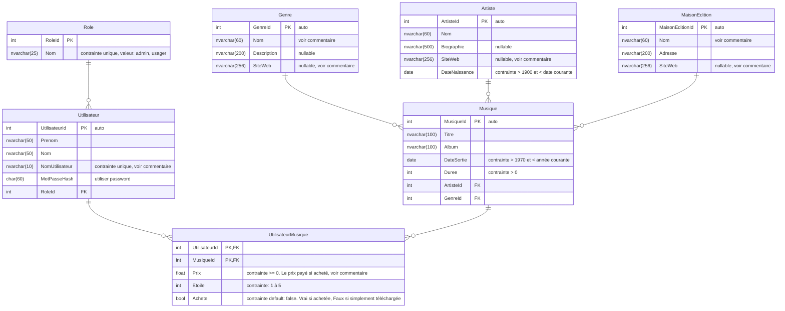

# TP3 DEA
Le DEA pour le TP3

Ce diagramme sur [mermaid.ink](https://mermaid.ink/img/pako:eNq1Vdtu2zAM_RVCTyvgBrYzJ42xFciQdhu6FMW6C7BkD4qtJgIsyZOlrl2af9lrvyM_NsqNW-fibA-dAwSxziFFHjLknCQqZSQmTA84nWoqxhLw0Qru7g4P1RysgRjGBD8lgK8VINYAYRuAKasApNQBqhsAscuiimv0UWXsO8wf3t3DpQF3-D6Fi7OnY3lNdTKj-kUYHcC5EugnUdJoinwGVvIflnlwTTNmdQw0FVx6YAs6ZboKZFHlPPpseMYLapC7dXcNK0PAi6g1qnKyFkvkH8CFZlKJBvB8JxI8ILWbGrJRXEOihGDSUK5ZPYbSUQcdDZW5oEXB3tFihm5s6ZRpyPHwp9Jp3aim7enZoygrWURdlqEtXAx_Vcc7PVsnrAy3watMUYNq8Zv1ZI9fg9-CDwxyB-X0dnkPBQeazJhZ3u8XwV14YhTP2JrPGAJY_oaoTp0olUHfOV3nQsquqM1MDFc0K1gLvuB5LQAswym1N-6k4CLPmIsDEMiW964GU6Q8NfQCql_Cjpo0rEu0r7sCH8v7iRvMuQHsZxNba7AU6wID_LpU2vCNPI8h6HV9YAZeAZUSw0ZVraaIbUo6sJptWfubrD7eUZh6L1XIWyb1zh6bslGJbUlSWewXpONXf_19TfE0KZxEA1YkmueGK4l20mYZnWQN_KhzAJfcsK9sUuM2t-BjXlSPVmpsZfak0j_ltnOOIPSGKxzn-ays6vNmsdY555QXBZXJjubxV81Tcjdb51EKwUZD9KHkScqd6NvdX0f_S8n7qWY4EJ-lwsQjgmlBeYpbtcxkTMwMh8CYuFW2Gh6O7qgujctbmZDYaBzgxOZOrNUqJnE5YTzCMHelhw-bulzYHsmpJPGc3JD48GXrZdv3g3bQ7XW7PT9qe-SWxGEUtEL_6KgXHoVh2Ik64cIjv5RCt0HLb7c7UeQMgrAbdsLS37cSdIEs_gBUU4Qc?type=png)

## Commentaires

Pour le CRUD et pour la génération dans le contexte, vous n'avez pas à respecter les règles pour Bogus. 

Pour la génération avec BOGUS :
### Table Genre
Pour le nom du genre de musique, il doit être parmi ceux trouvés sur https://fr.wikipedia.org/wiki/Liste_de_styles_musicaux . Choisissez en 5. De plus, le site web doit être celui correspondant sur ce même site (https://fr.wikipedia.org/wiki concaténé avec le nom du genre séparé par des _ ). 

### Table MaisonEdition
Pour le nom de la maison, il doit être parmi ceux trouvés sur https://fr.wikipedia.org/wiki/Cat%C3%A9gorie:Maison_d%27%C3%A9dition_d%27ouvrages_musicaux  Choisissez en 5. De plus, le site web doit être celui correspondant sur ce même site (https://fr.wikipedia.org/wiki concaténé avec le nom de la maison séparé par des _ ). 

### Artiste
Pour le site web, il n'y a pas de règles spécifiques, à part être un nom de site web "valide"

### Utilisateur
Le champ NomUtilisateur doit être composé des 6 premiers caractères du Nom et de la première lettre du Prenom suivit d'un nombre aléatoire entre 1 et 99. (Le risque de collision devrait être à peu près nul. Si jamais ca ne fonctionne pas, refaire la génération)

### UtilisateurMusique
Si l'indicateur Achete est faux, le prix doit être 0. 