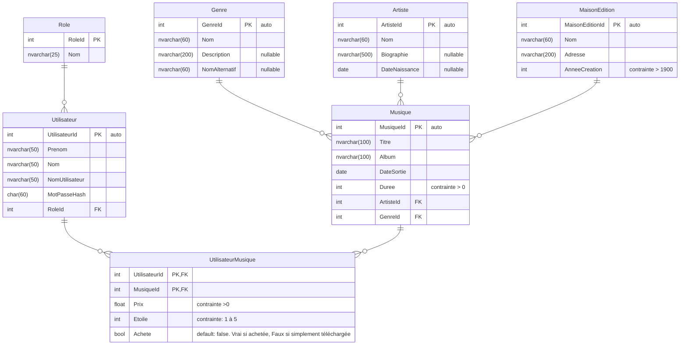

# TP3 DEA
Le DEA pour le TP3

Ce diagramme sur [mermaid.ink](https://mermaid.ink/img/pako:eNqlVdFu2jAU_RXLT6sUUBIIlDxMYqPdJkSF1m0Pgz24yQUsOTZz7ImW8i977Xf0x3adEggNMGlLFER8zr2-51zHXtNEpUBjCnrA2VyzbCoJXlqRx8dGQ62JNSQmU4p3AeBrCWQHQGZPAHMoAaRUAaZPANmxiLKuyWcl4AdZv7y7i0tD3OCnlIyH-2H5i-lkwfSbMLogN2orbFPKmHw1XPCcGbC6lq6CFVmxBmaNKgs8SB_5F2SsQZYz1MCbc0hlpj2pIHSQMFJmzPIcPrJ8cVTw9XAnayssqwob2Zz_tPBXfd718JCwDayDM6GYQb18hZ4kShrNkA_krV81x6W4MooLOGDFJCDPv0lUpd4pJUg_WYBx3BRmzAoTkxkTOTTJNwwkOSfMEZ6fwCPXzK7cSM6zpYAMcCYExPOTM22OlP1i2ZDyX2Ynp6yoKj3X5sDHfnzhRsMpsC_ubKXTKdpLBvhzq7ThcDjrwGqAVw6SmoV9DMxNtc8l8gGkPtr_OUwKrKazjDivsnNyvYZO4gDyRPOl4UpiFmmFYHcCzmXqCwNaMsNnRwJ2VTM92Wqt1b334F8rj1zl77jC3W254HCi8F27bhjPcyYTOFdwBpMR8pS8Srlzo76squj_2t5PNeAu8MoYKQHea2DbbhwspaDn71bThno0A50xnuJGX9Q5pWaB386UxvtvztEd1RV5ey8TGhttwaN26azZng7lIKAwpUcvZ0dxhHh0ySSN13RF40a72W75ftAKur1ut-dHLY_e0ziMgmboX172wsswDDtRJ9x49EEpzBo0_VarE0VBux3i0w7bRb7vBeim3PwBS-wC3w?type=png)