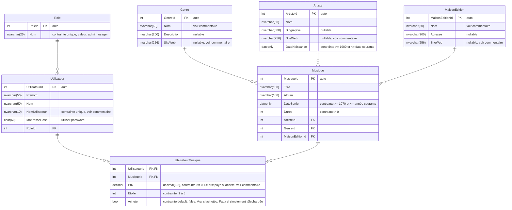

# TP3 DEA
Le DEA pour le TP3

Ce diagramme sur [mermaid.ink](https://kroki.io/mermaid/svg/eNqtVMtu2lAQ3ecrRl4FiUQmErRFTSUqkrZKg6KmjwXqYrAncKX7oPeRJkryL93mO_ixzgUTGzBkg1f2OXPnceb4ku0LHFtUB8CPNfD4eHRkHiB46EKSzFF-X6KqRFWoQ8e0RJl_QdHWoWojtmhi-M1I-g0P88_4CO0hYl9yuLqABIM3yQupb9FmE7SHJ-0GDIyCJDPaW-RDBEGLP4GacIuSgu0C5kroJgSHY7KLHE_FkMMfXkjh0HPgevEKtbuHdtqAK0vaqHpuUEe0FkSlSP0MRljIjFKkPQpLZfl5lg5nuTT-Cp2jz-gmkIR5QrIwZeyvsXlSp-j5RSHDQgdV1eEyuFj7NTmaRY4lXxzb4HLKhEIJLJG4g6T4PHzbPGk0oTLxh1NIj-ErwTTGTfF-9gxOAGYT8rPnXUrE6mfeCElVCbvQgtk_aJdxI2Mk9GK-lUDu8AaD9F24QenoGH4yXinNWzjHcBcRJ9RUUuwAmJCz57iEMYcUNn6Cg-I_GW5RsarSVkO1Ul7rd-EtbeF6chRKT-W8FKPlPfT55dpYL1bnY2Vb796kQB7enwJqzQ2zksEis6sy9oOltcOQrob0OL_zFRMtiU-kbQ18icIZfZYLL4zesN6YhvNz6zotk-1QqZMWv_52Z5TXRFStTy6zYhr7gEQHKXEka4PbnQZcC0-_aFQGbnNgMQjaYaHM-iilYK8PU3eBMPNRGL6vp5O42L01vmGdAW_Koc5q3JMu3RMPrHmnEEDRcGXVG85f88E-N9vLLfENuM-t_geDOR7N)

:::warning Avertissement
En cas de différence entre le diagramme sur cette page et celui sur mermaid.ink, c'est celui sur cette page qui est la bonne version
:::

## Commentaires

Pour le CRUD et pour la génération dans le contexte, vous n'avez pas à respecter les règles pour Bogus. 

Pour la génération avec BOGUS :
### Table Genre
Pour le nom du genre de musique, il doit être parmi ceux trouvés sur https://fr.wikipedia.org/wiki/Liste_de_styles_musicaux . Choisissez en 5. De plus, le site web doit être celui correspondant sur ce même site (https://fr.wikipedia.org/wiki concaténé avec le nom du genre séparé par des _ ). 

### Table MaisonEdition
Pour le nom de la maison, il doit être parmi ceux trouvés sur https://fr.wikipedia.org/wiki/Cat%C3%A9gorie:Maison_d%27%C3%A9dition_d%27ouvrages_musicaux  Choisissez en 5. De plus, le site web doit être celui correspondant sur ce même site (https://fr.wikipedia.org/wiki concaténé avec le nom de la maison séparé par des _ ). 

### Artiste
Pour le site web, il n'y a pas de règles spécifiques, à part être un nom de site web "valide"

### Utilisateur
Le champ NomUtilisateur doit être composé des 6 premiers caractères du Nom et de la première lettre du Prenom suivit d'un nombre aléatoire entre 1 et 99. (Le risque de collision devrait être à peu près nul. Si jamais ca ne fonctionne pas, refaire la génération)

### UtilisateurMusique
Si l'indicateur Achete est faux, le prix doit être 0. 