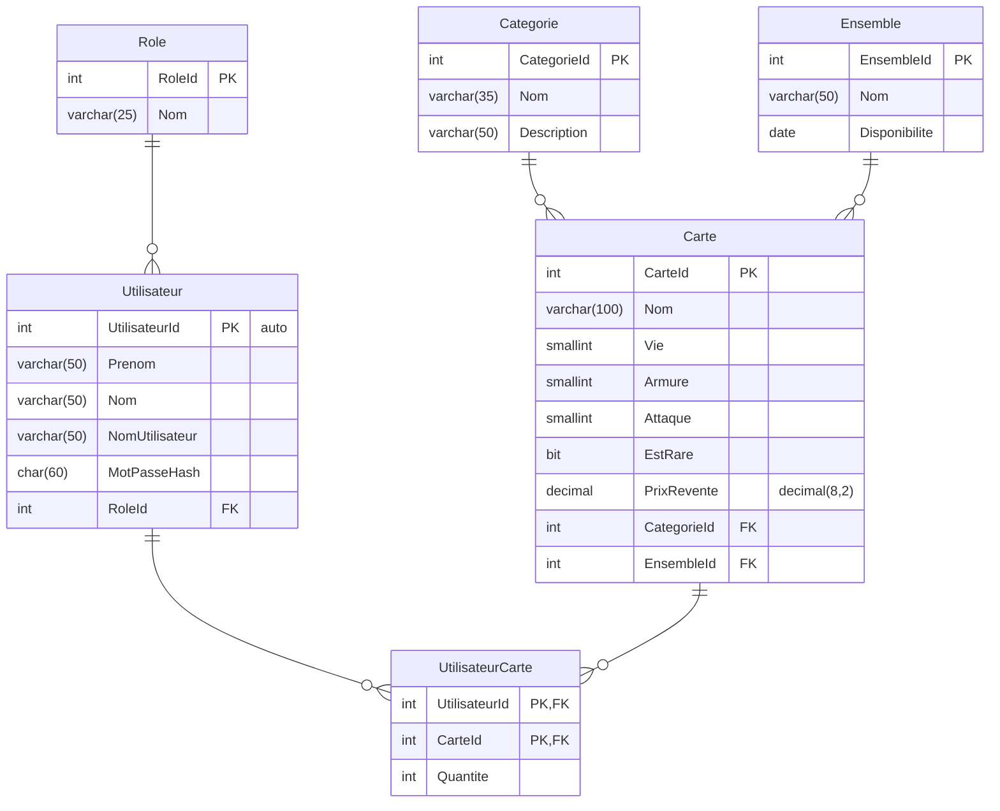

# SuperCarte DEA

## Diagramme entité-association

Voici le DEA initial de l'application.

Ce diagramme sur [mermaid.ink](https://mermaid.ink/img/pako:eNqFlF1v2jAUhv-K5asiBZRvaO6m0WoTasWYtovBLoxzWiwlNnNOqnYp_31OQqghaZdIQT7P8fl4j3FFuUqBJhT0XLBHzfKNJObRiry-jseqIiWShGyoeRtglh3gZ4CzE-HsjIB8B5hlP1aXf71SGfwmVbuuHyGR1MavKVku3sxPTPMd01d-NCL3KictOXSRSlz_QJGJgiGUuhfQYk1cUwUrUXUl2gkid0SWGqTKh9n9B8BKQ96cGo_YeNwpXLKigC-s2JHBjm8Xp77qn2Nv3O7tM9MI_23QuV2cOzTbhtG3kkkUCBeScrZuc1XvRerr4LmXChU5y7J6208BA9ZPOi_1IEBkf0qLbAWSmwJXzHZPgQuzwwxMPK_gCSSCGe3RejVz_JE94rZ6hEelha12x25kAfn2chDd8V53-FIQa9uQJr1Dk5oSyFwUeyXF1oxtQHlcn-rsjdruYChfEH1wSOdQcC32KNQx14E6NAedM5Ga-6FJtaG4gxw2NGm0fGBlhrWMtWv9r_n-IjlNUJfg0HJfd3O8VGjywLLCWCEVqPRde-c0V49D90zSpKLPNAmCSRRHUzcMQvMNPD9y6AtNxl7sTkIvdL146gdx4M8ODv2rlAnrTSJjmYXhtedOfc-7bsL9alhdx-Ef8OFvTg?type=png)