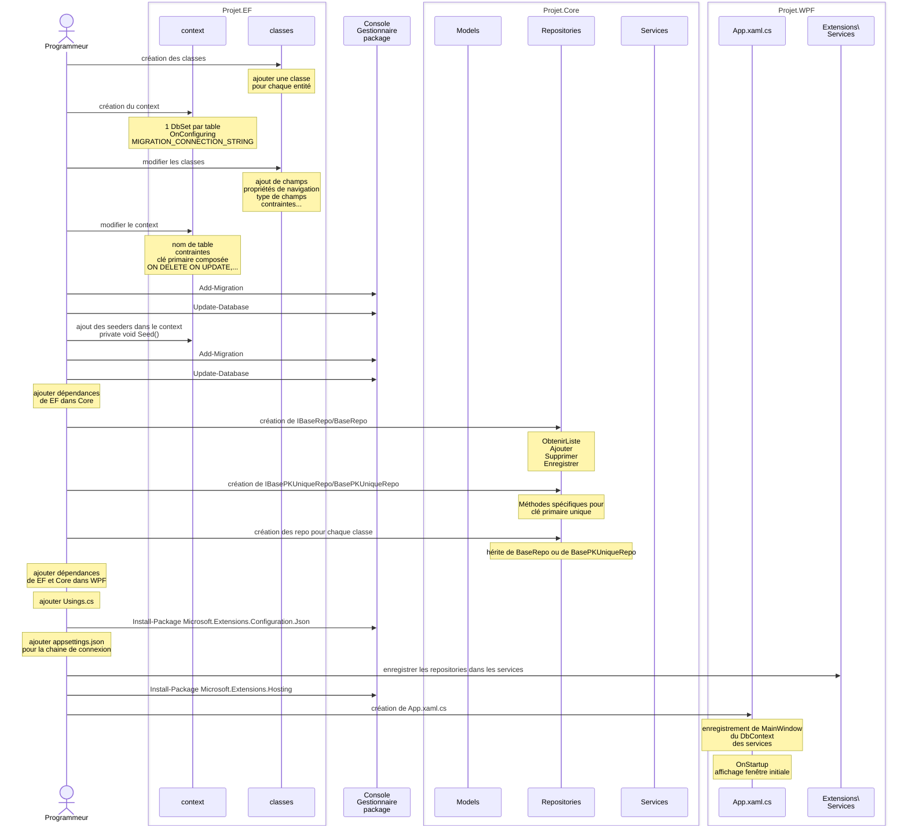

# Résumé du processus

Cette section vous donne un résumé des étapes à faire pour créer un projet WPF tel que démontré dans le cours. 
Veuillez vous référer aux notes de cours pour les détails. 

## Les étapes:

Ce diagramme sur [Kroki!](https://kroki.io/mermaid/svg/eNqlVduO2jAQfe9X-LGVSqq-omolCtkt7XLRAtqXSsgkk6y3ie16HJZ-Ev2N_FjHDoEQiLTV8oLjHHvOnJk5QfhdgIxgJHhqeP6O0Y9HVhmmjUoZRzanf3qTQ2H8243aMbf5DDYIb_2W5saKSGguLYNkHSlpYWfd4cPyKirjiOBBfoUeBDKuwBS1d3NzxPVZZMo9t0JJFsP5GaksMLUFwxpw_qwKS1uFhAP4y8bcaFUYFj1xSppCWWHLfTtcxfgsXnGWx3m4Gv6ZjTYLsC5LZvkm8-FmcqhkItLCCJm6jcn47mGwHM-m6-FsOg2HfrlYPoyndxcaRal26tANqKrr7gAdIcmFqbLh0S-eQodguYpFIohm9mq9SFqnTq7RX2-UNqLck0jo3ki-FamXxL21fzSc450WhgsSBIMg6NK1QesVskqVuyBHRRsx_GNW7imIyJ0kdF2uFZb7SvspG4X34TJktFrNR4Nl-LFFixTus0Ec9yaCWtwldvF2pWNuoTfixIAjdCVVq4cMAWIwpBeX2Eix0lNs6TK2VSJmC8K9__BGNhcDOVQGLhuJNtckO2SunyZugddBBrRymAf6R0EuIKADiWC2DrmgfxG1hvdUSkf-NItxudeE4eQ3vnpU2PC2UupE_JBuTaffnHs2_kppO3af6kUr4Okcm20sSGHuBVrfEIOKhVsuCu2apnoIpYGUQAbMaxnMf6ykIA85MmludDOa0Cw9Kd8lutxHNAZ0BJkzpctmLvyF1xm1zNCXrWlt1VB3E3kq90ZYP761jkwV9eNZMscWO3TY4_zS8190subau9VA62DH8yyIkF3F1Y0T7qg6SBngT1-Rt_cRma_roqqfappdV6yQHBmJZXvGxhItz7LevPJWNhGRUagS-tgdGQe1q_sSBN_xMKpdwUgbBGt9xGes7NOXK-OuYkJWRkrODrvW2NeS9eHUpd7QTWNEa7Nx7tOQ8X-z-qbQcWyHJ_bnI9CocSvtGn4im9NX1p2ZUJaPQsbqxResoK_l8OSMcZv65ZUzubDUSoV2eJ4kgoSjRBKQ5V-Kw4QUVvCsavp3_wCUhBno)

### Base de données (EF)

Le projet EF contient la structure de la base de données : les modèles de données, DbSet, migrations, et seeders.

- Créer un nouveau projet et lui donner le suffixe .EF
  - Le type de ce projet est Bibliothèque de classe
- Créer le répertoire Data
- Créer une classe pour chaque entité du DÉA (les modèles de données)
- Créer le répertoire Data/Context
- Créer une classe pour le contexte (NomDuProjetContext.cs)
- Créer les DbSet pour chacune des entité 
  - un DbSet créer une liaison entre les classes du modèle de données et les tables dans la bd
- Créer les migrations
  - Add-Migration [nom migration] -StartupProject [Nom Projet Entity Framework]
  - Les migrations, en mode Code First, sont basées sur les changements faits dans les modèles et dans le contexte
- Synchroniser les migrations à la bd
  - Update-Database -StartupProject [Nom Projet Entity Framework] -Migration [Nom migration]
- Si nécessaire, faire les corrections au contexte dans OnModelCreating afin de préciser des détails de la bd
  - Faire les changements
  - Créer et appliquer la migration 
- Si nécessaire, ajouter des seeders afin de populer la bd avec les données de bases

### Core

Le projet Core contient les Services, les Repository, les Validateur, ainsi que les modèles du domaine.

- Créer un nouveau projet et lui donner le suffixe .Core
  - Ce projet est dans la même solution que le projet .EF
  - Le type de ce projet est Bibliothèque de classe
- Ajouter la dépendance au projet EF
- Créer les répertoires Repositories, Services, Validateurs, Extensions, et Models
- Créer le répertoire Repositories/Bases
- Créer l'interface de base pour les repositories (Repositories/Bases/IBaseRepo.cs)
- Créer les classe Repositories/Bases/BaseRepo.cs pour les requêtes de base,  et BasePKUniqueRepo pour les requêtes utilisant la clé primaire.
  - Classes génériques contenant la base pour toutes les méthodes qui devront être implantées dans les repositories
- Créer les repositories pour chacune des classes du modèle du domaine. 
  - Ces classes font le lien entre les classes du domaine et les classes de données dans EF.

### WPF

Le projet WPF contient l'interface usagé du projet.

- Créer un nouveau projet et lui donner le suffixe .WPF
  - Ce projet est dans la même solution que les projet .EF et .Core
  - Le type de ce projet est Application WPF
- Définir ce projet  en tant que projet de démarrage
- Ajouter les dépendances vers EF et Core
- Déclaré les using globaux
- Ajouté les packages nécessaires
  - Install-Package Microsoft.Extensions.Configuration.Json
- Créer appsettings.json et ajouter la connexion à la bd. 
- Créer les classes d'extensions afin d'enregistrer les services
- Ajouter le hosting
  - Install-Package Microsoft.Extensions.Hosting
  - configurer App.xaml.cs