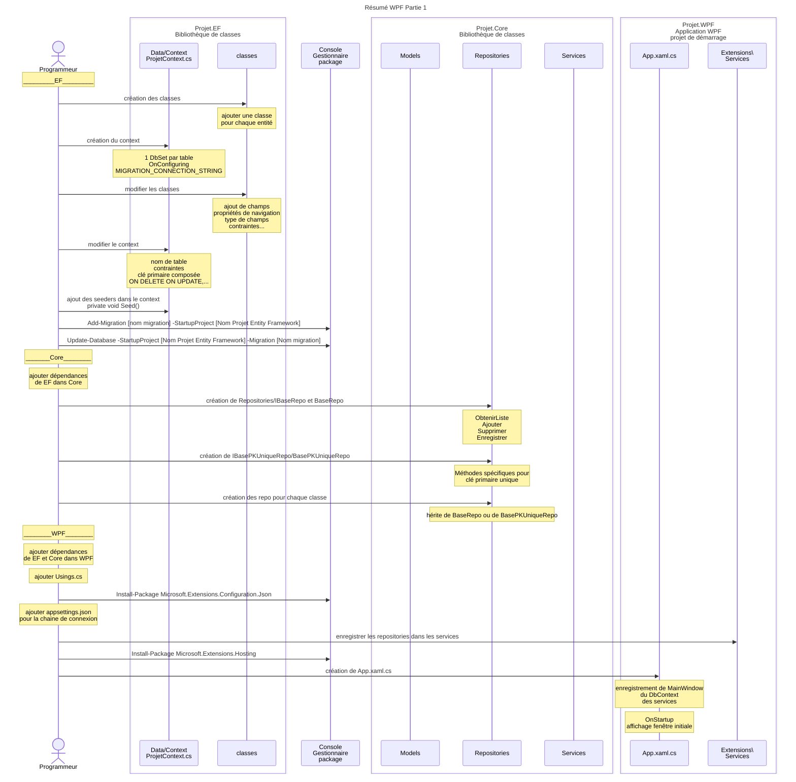

# Résumé du code

Cette section vous donne un résumé des étapes à faire pour créer un projet WPF tel que démontré dans le cours. 
Veuillez vous référer aux notes de cours pour les détails. 

## Les étapes:

Ce diagramme sur [Kroki!](https://kroki.io/mermaid/svg/eNqlVttu4zYQffdXzGML1A721SgCZGM563Z9QZxgH7aLgJbGNrMSyZKU4_2jur-hH-sMadnyLZugfrAocnjmzOHMUA7_LlGl2JNiYUXRAvp56XOE-2rjyqLawJdJHybCeonwoRUMROq1BWP1AoSDCT1pa4GlDavhb6bXwCvP6DtJ__eZvf4oZ7nUfln9Qx4hQ0hz4Ry6YG4YP5VGKA84f0q18rj2jN4TXlzdxneGiZjbiU56fntA5t1NH6iy8FTaI-gVxgi68FT_kv5uGFFpuX19vQPsQmqrjfBSK-J_CL4HbZiLZ116mipVHS1HYHRpIV0KlgEViV1tjt3F6A78lbCdPeOuNv8AvdkUPcsBXszy4G6sSKy5XJRWqgVPDAd39zcPg_Ho6XY8GiW3YTh9uB-M7k7ETBeGZSQEpyPcHTompIS0MRqRfhcLvCBYoTM5l0Qzf7NeITWWojAuwFttrKw2JJLjFSVWchEk4VX_w-ChPWthhSRBXKfTuaRrg9YbZFW6YCc7RRs-wmtORUIkC5aE4AqjXbWJ2o-gl3xOHhKg0eOkd_OQ_PYKrTp-Bw4xQ0sRC-UaJKMiciWI5krLDKZk98uvTTw6sS7cZFl7KKkqQ-585QCK-vUbtKeejrg0oZRSD19HtB7rChJOyB_Qp4LGF22_fzvBfjQZuW9zXc4EVdm70KBJa3RAq9V6rTpvtcWD4mw2GF58V4tJGY2SAHPO7iEPLhhZNJpt7unpJLU9eQnOoV2x5ZSeMv1Jz6k7Q1ZtDNkI6sAhl4hz0o-nzkEdiF_T6Ta70AGxq8FHOhGeARK_Hh8R2OPAeOZRSftZOh_0u4mseDgtDad0fEmUxQUZWbRvYBRITP58VJJOgQlcHU9cZjSkSl_qUAGm2qRUpLTFAbfM01IrA-B5RketOhxjs_HGzLhMZFltrPQhiXaa6rJ-PQjm3AHXqUp350nWbpOWloLmxuQyjUy3UyYWD_mi9CiEtbv-2si5FzN_EiZ0Z4LorEWR020IZ-3q1EzWdN6OPLm_whn__0wlmpynMWOJ_qsQj45uILe7s_c9ZaCcF3nensS7BIYytdrpOX067Bh36lssSNX5w2n1qjPSxqH3weOzi9dFSIBccA5IFRsE3WS4llusLaVasi7u8z5cYLZRa3Vr5l7dkPG9UX3Sjjkeuyf2h0XVOOOjsGvzPdmCvip4z5Ci_CJVpl_CgZX0ddD4kMqOqZ9CjtW2t7O9mM8lCUeBzFFV_5IfkEp6KXJstf4Dw8-h2A)

### Base de données (EF)

Le projet EF contient la structure de la base de données : les modèles de données, DbSet, migrations, et seeders.

- Créer un nouveau projet et lui donner le suffixe .EF
  - Le type de ce projet est Bibliothèque de classe
- Créer le répertoire Data
- Créer une classe pour chaque entité du DÉA (les modèles de données)
- Créer le répertoire Data/Context
- Créer une classe pour le contexte (NomDuProjetContext.cs)
- Créer les DbSet pour chacune des entité 
  - un DbSet crée une liaison entre les classes du modèle de données et les tables dans la bd
- Créer les migrations
  - Add-Migration [nom migration] -StartupProject [Nom Projet Entity Framework]
  - Les migrations, en mode Code First, sont basées sur les changements faits dans les modèles et dans le contexte
- Synchroniser les migrations à la bd
  - Update-Database -StartupProject [Nom Projet Entity Framework] -Migration [Nom migration]
- Si nécessaire, faire les corrections au contexte dans OnModelCreating afin de préciser des détails de la bd
  - Faire les changements
  - Créer et appliquer la migration 
- Si nécessaire, ajouter des seeders afin de populer la bd avec les données de bases

### Core

Le projet Core contient les Services, les Repository, les Validateur, ainsi que les modèles du domaine.

- Créer un nouveau projet et lui donner le suffixe .Core
  - Ce projet est dans la même solution que le projet .EF
  - Le type de ce projet est Bibliothèque de classe
- Ajouter la dépendance au projet EF
- Créer les répertoires Repositories, Services, Validateurs, Extensions, et Models
- Créer le répertoire Repositories/Bases
- Créer l'interface de base pour les repositories (Repositories/Bases/IBaseRepo.cs)
- Créer les classe Repositories/Bases/BaseRepo.cs pour les requêtes de base,  et BasePKUniqueRepo pour les requêtes utilisant la clé primaire.
  - Classes génériques contenant la base pour toutes les méthodes qui devront être implantées dans les repositories
- Créer les repositories pour chacune des classes du modèle du domaine. 
  - Ces classes font le lien entre les classes du domaine et les classes de données dans EF.

### WPF

Le projet WPF contient l'interface usagé du projet.

- Créer un nouveau projet et lui donner le suffixe .WPF
  - Ce projet est dans la même solution que les projet .EF et .Core
  - Le type de ce projet est Application WPF
- Définir ce projet  en tant que projet de démarrage
- Ajouter les dépendances vers EF et Core
- Déclaré les using globaux
- Ajouté les packages nécessaires
  - Install-Package Microsoft.Extensions.Configuration.Json
- Créer appsettings.json et ajouter la connexion à la bd. 
- Créer les classes d'extensions afin d'enregistrer les services
- Ajouter le hosting
  - Install-Package Microsoft.Extensions.Hosting
  - configurer App.xaml.cs