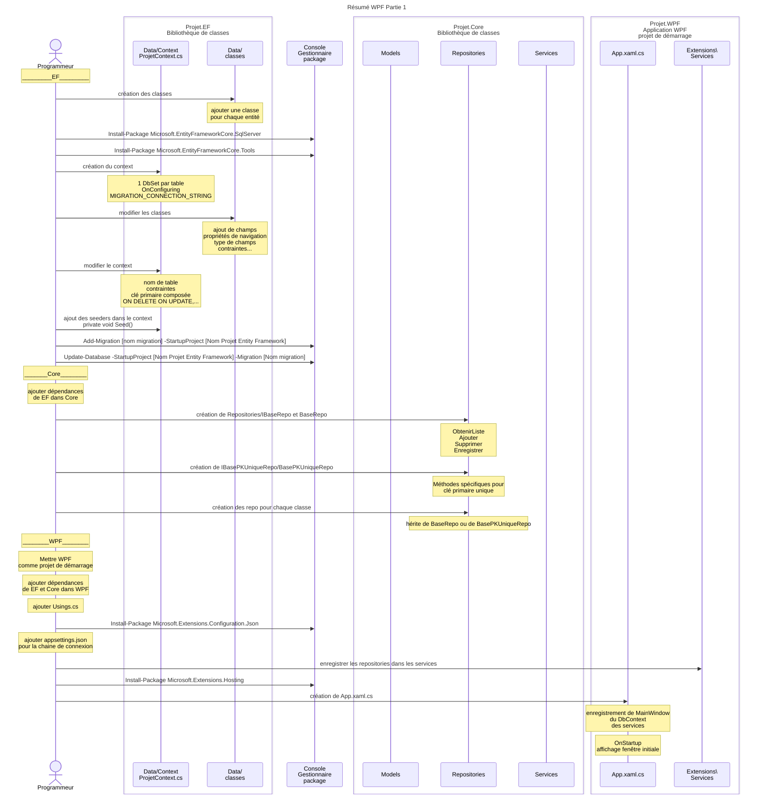

# Résumé du code

Cette section vous donne un résumé des étapes à faire pour créer un projet WPF tel que démontré dans le cours. 
Veuillez vous référer aux notes de cours pour les détails. 

## Les étapes:

Ce diagramme sur [Kroki!](https://kroki.io/mermaid/svg/eNqlVstu2zoQ3fsruOwFrh10a1wESGM51239QOygi7YIaGlsM5VIlqQS94-q_oZ-rDOkZUvyAw3qRSKR8zgzc2ZGFr7nIGMYCL42POsw_DnhUmD3ZWHzrCzYp9mQzbhxAthbf89jpwzTRq0Zt2yG_1Ezg9z4W_9nqbaMbp7A9aLhf0tz_U4sU6HcpvyJDlkCLE65tWC9uCbzsdBcOgarx1hJB1tH1gfc8avb8E5mgs3dQS8-re4t77VJre4MZHKkFa81yaNdq1IgjTuwTigpuTD-XfP4G1-D15TKAVPPEJLQZ4_VLxruH4MLvO5eX-8x9VlsyoKTYUyBbeTgYLQmzp9U7vAol1XCPBaVGxZvOGUSJJarLOruMJg-G0nreJp2ZwE3G4vYKKtWWA_S-DHEmsGLMt9ulYHe_Hs6B4PO_9LOQqnUtkMPxWrEnrPd6YnQK_G3bLCcg6M6MceXoSxTiTVaiXVuhFzTwXh0d3-zGE0nj7fTySS69Y_zxf1ocnemBJlKxEqgs_SPK-D5uuGZtj79RmkjygLTbulG8mex9oHRrfuhoSlPERkuMCzb6_XOZacG6w-SI1VGTvZ5qfkIfMfGRZAZ0RfNZVrZsggZnLBB9DFaRAyfHmaDm0X07wVYVfyWWYAEDEbMpa2BDBkRzxxhPiuRsDnKvfnniEg3SdIdCxwVngGfKYCsev3KunOH7Zhr39-xY58neB-anQWisT3Tvh7ZftAJuu9Suy85tv6rrLE6rEkDVqdzqd-J8Y12r089unzV3IvJGpIAUppEY3o4I2RAK5K5x_9W4CwW58xZ7GmSpN4WcWv-taOqZk1SFhplOG4FzyXEHA1D1SmoRvIrOP36XGsAuxq9w4rQCcPkV88tAAc7bLp0IIX5KKzz-bsJqOhxnmuidHiJpIE1CpnWzDqNyIOYfXiQAqtAAK7aB-cRjbHTN8p3gC6LGJsUVSyjIXzcark3eBpRa_j7MtZHeWDGeSCbsjDCeRLtc6ry6rURzKkCV1TFfd5gbUtsDA6T6rd-GCy42umGegddITsybky1ConyO8ajhi-Y1qmIQ5i7o7PadcK-6NUj134No4nelmcp7nd2Uq7idbRFslj0ZL94gvw9zREmkTzQHeFfNPFgcQnZ_VfIYSBdWJp7xL1qkflU9d5bJS86w9xYLI33-GTDrvHsSTkRSMgwXfCTBbZiZ2sHqUpZHw5N47efqTVqNddp0NfS-Nqo_leWMLbdI_pmR9Zq3Aq7Ej-AzfAjh3TGGOUnIRP14guW4wdC7dMwaUM_NjmVu8VA8ny1Epg4DGQFsvxFpBdSOMFT6HR-A9D67D4)

### Base de données (EF)

Le projet EF contient la structure de la base de données : les modèles de données, DbSet, migrations, et seeders.

- Créer un nouveau projet et lui donner le suffixe .EF
  - Le type de ce projet est Bibliothèque de classe
- Créer le répertoire Data
- Créer une classe pour chaque entité du DÉA (les modèles de données)
- Créer le répertoire Data/Context
- Créer une classe pour le contexte (NomDuProjetContext.cs)
- Créer les DbSet pour chacune des entité 
  - un DbSet crée une liaison entre les classes du modèle de données et les tables dans la bd
- Créer les migrations
  - Add-Migration [nom migration] -StartupProject [Nom Projet Entity Framework]
  - Les migrations, en mode Code First, sont basées sur les changements faits dans les modèles et dans le contexte
- Synchroniser les migrations à la bd
  - Update-Database -StartupProject [Nom Projet Entity Framework] -Migration [Nom migration]
- Si nécessaire, faire les corrections au contexte dans OnModelCreating afin de préciser des détails de la bd
  - Faire les changements
  - Créer et appliquer la migration 
- Si nécessaire, ajouter des seeders afin de populer la bd avec les données de bases

### Core

Le projet Core contient les Services, les Repository, les Validateur, ainsi que les modèles du domaine.

- Créer un nouveau projet et lui donner le suffixe .Core
  - Ce projet est dans la même solution que le projet .EF
  - Le type de ce projet est Bibliothèque de classe
- Ajouter la dépendance au projet EF
- Créer les répertoires Repositories, Services, Validateurs, Extensions, et Models
- Créer le répertoire Repositories/Bases
- Créer l'interface de base pour les repositories (Repositories/Bases/IBaseRepo.cs)
- Créer les classe Repositories/Bases/BaseRepo.cs pour les requêtes de base,  et BasePKUniqueRepo pour les requêtes utilisant la clé primaire.
  - Classes génériques contenant la base pour toutes les méthodes qui devront être implantées dans les repositories
- Créer les repositories pour chacune des classes du modèle du domaine. 
  - Ces classes font le lien entre les classes du domaine et les classes de données dans EF.

### WPF

Le projet WPF contient l'interface usagé du projet.

- Créer un nouveau projet et lui donner le suffixe .WPF
  - Ce projet est dans la même solution que les projet .EF et .Core
  - Le type de ce projet est Application WPF
- Définir ce projet  en tant que projet de démarrage
- Ajouter les dépendances vers EF et Core
- Déclaré les using globaux
- Ajouté les packages nécessaires
  - Install-Package Microsoft.Extensions.Configuration.Json
- Créer appsettings.json et ajouter la connexion à la bd. 
- Créer les classes d'extensions afin d'enregistrer les services
- Ajouter le hosting
  - Install-Package Microsoft.Extensions.Hosting
  - configurer App.xaml.cs