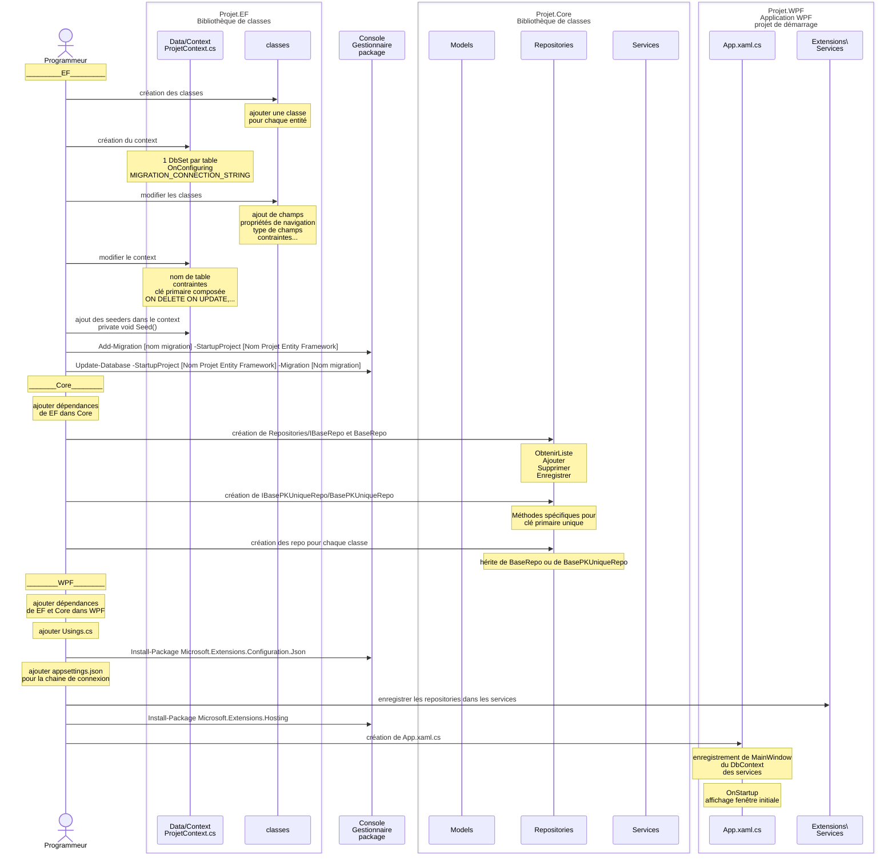

# Résumé du processus

Cette section vous donne un résumé des étapes à faire pour créer un projet WPF tel que démontré dans le cours. 
Veuillez vous référer aux notes de cours pour les détails. 

## Les étapes:

Ce diagramme sur [Kroki!](https://kroki.io/mermaid/svg/eNqlVtty2jAQfecr9NjOFDJ9ZTqZSYJJacNlQjJ5SDMZYQvYxJZUSSb0j0p_wz_WXQmDzSVNpjxgXdZnzx7trmzFz1zIWHSAzwzPGgx_PHbKMG3UjHHLRvjEnUzkxu_6v4laMtp5Eq4Vdb9MzOk5TFJQbl78RkCWCBan3FphvbnmxkEMmkvHxPQxVtKJpSP0Dnf85CLMCSZgrhda8eHXPTK9XfUhZOKfUjnB1EKECNrssfxF3c0woOJ28_R0A9hmsSlW3IGSyL8OvgWtmPMnlTtcymUZLUWgVW5YPOckg5AOXLHadReiq_nL2Xr1gLvS_DPrTMbCkRzM8Unq3Q0lijWFWW5Azmih37u8PrvpDQePF8PBILrww_HNdW9wuSdmPNMkIyJYFeAuhSVCkoMJ0fD4mc_EEcEylcAUkGb6Zr18asx5pq2HN0obKFYokqUdyRcw85LQrvulRd2etDAcUBDbarWO6Vqh9QZZpcrIyUbRig8_TYsVOoGMJEG4TCtbrIL2A9aJrqKbiOHodtQ5u4k-vUKrjN8yK0QiDEbMpa2QDIrAgiPNhYKEjdHuw8cqHp5Ym50lSbMPWJU-d-4pgKycPrDm2OER59qXUuzY_QD3Q12xiBLyF-tiQYsXZZ4f9rBvdYLum1SXE45V9i40VqU1qNFqNF6rzgtlRK04qw2GNt_VYmJCwyQQKWV3nwZHjIzQimyu8WkB2x4cg7PCLMhyjE-I_9Fzys6QFCuNNhwbrM8l5Bx1w6lTUDXxSzrtaheqETvpneOJ0ApD8cvxDoEtDhtOnJBgrsA6r99ZYEXDca4ppcMkkkbM0MgI8wZGnsTo-60EPAUicLK7cJxRHyt9rnwF6GIVY5HiK5ZRy9wvtdwDHma006r9MVYbb8iM40TmxcqA80m00VTl5bQWzKEDLlP1btTdy9p10uKW11zrFOLAdL2kQ_GgL0yPjBuz6a-VnHvR00eufXdGiNaSZynehuygXZma0RLP26In-8Of8f9nKtKkPA0Zi_Rfhbi1eAPZzZ297Sk9aR1P0-Yo3CWsD7FRVk3x02HDuFXeYl6q1jer5KvOUBsrnPMen2y4LnwCpJxyAGRoEHiTiSWssdaUSsnaYpv3_gIzlVorWzP16oqM743qq7LEcdc9sq8XVeWMd8IuzbdkM_yqoHf6GOUdyES9-APL8eug8iGV7FLfhxzKdW8nez6dAgqHgUyFLP6gHwYSHPBUNBp_AQeTlqA)

### Base de données (EF)

Le projet EF contient la structure de la base de données : les modèles de données, DbSet, migrations, et seeders.

- Créer un nouveau projet et lui donner le suffixe .EF
  - Le type de ce projet est Bibliothèque de classe
- Créer le répertoire Data
- Créer une classe pour chaque entité du DÉA (les modèles de données)
- Créer le répertoire Data/Context
- Créer une classe pour le contexte (NomDuProjetContext.cs)
- Créer les DbSet pour chacune des entité 
  - un DbSet créer une liaison entre les classes du modèle de données et les tables dans la bd
- Créer les migrations
  - Add-Migration [nom migration] -StartupProject [Nom Projet Entity Framework]
  - Les migrations, en mode Code First, sont basées sur les changements faits dans les modèles et dans le contexte
- Synchroniser les migrations à la bd
  - Update-Database -StartupProject [Nom Projet Entity Framework] -Migration [Nom migration]
- Si nécessaire, faire les corrections au contexte dans OnModelCreating afin de préciser des détails de la bd
  - Faire les changements
  - Créer et appliquer la migration 
- Si nécessaire, ajouter des seeders afin de populer la bd avec les données de bases

### Core

Le projet Core contient les Services, les Repository, les Validateur, ainsi que les modèles du domaine.

- Créer un nouveau projet et lui donner le suffixe .Core
  - Ce projet est dans la même solution que le projet .EF
  - Le type de ce projet est Bibliothèque de classe
- Ajouter la dépendance au projet EF
- Créer les répertoires Repositories, Services, Validateurs, Extensions, et Models
- Créer le répertoire Repositories/Bases
- Créer l'interface de base pour les repositories (Repositories/Bases/IBaseRepo.cs)
- Créer les classe Repositories/Bases/BaseRepo.cs pour les requêtes de base,  et BasePKUniqueRepo pour les requêtes utilisant la clé primaire.
  - Classes génériques contenant la base pour toutes les méthodes qui devront être implantées dans les repositories
- Créer les repositories pour chacune des classes du modèle du domaine. 
  - Ces classes font le lien entre les classes du domaine et les classes de données dans EF.

### WPF

Le projet WPF contient l'interface usagé du projet.

- Créer un nouveau projet et lui donner le suffixe .WPF
  - Ce projet est dans la même solution que les projet .EF et .Core
  - Le type de ce projet est Application WPF
- Définir ce projet  en tant que projet de démarrage
- Ajouter les dépendances vers EF et Core
- Déclaré les using globaux
- Ajouté les packages nécessaires
  - Install-Package Microsoft.Extensions.Configuration.Json
- Créer appsettings.json et ajouter la connexion à la bd. 
- Créer les classes d'extensions afin d'enregistrer les services
- Ajouter le hosting
  - Install-Package Microsoft.Extensions.Hosting
  - configurer App.xaml.cs