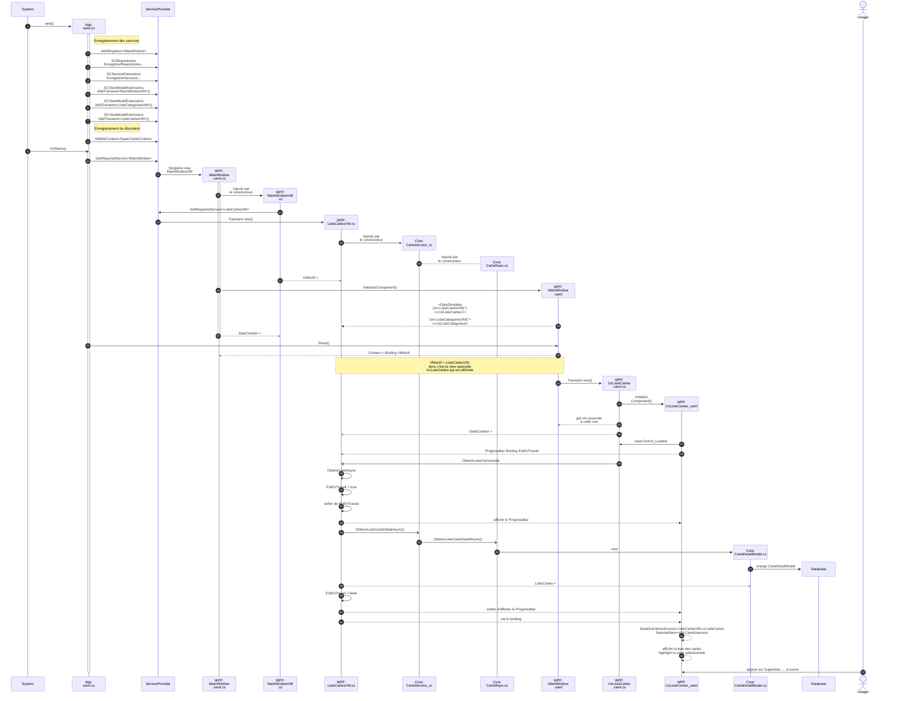

# Exécution de la partie 2

Ce diagramme synthétise le processus d'exécution de ce que nous avons vue jusqu'à maintenant. 

Pour ce diagramme en plus gros sur [Kroki!](https://kroki.io/mermaid/svg/eNqtV91u2zYUvs9TELvpAtTOveAISJOsCFCvRd26uQto6ljmIJEaSSnphr3LbrPX8IvtkJJtSSQdp1tvUvOc7zv_h6KG32sQDG44zRUtzwj-o7WRoi5XoNzPiirDGa-oMGTxXRsoz9w5U0ANDMRXVfXwRMvigWlCtf05na1Uao-mTDtUyzBJ055uQgQ8_nzeGmeGN5a3J_fc0KAaa2CBfzmDT0o2POvc_VUiWPF8Y4hck4GVW6Eg59ooKAFZMtCOCRlaEz1ldNCKEnKVZQsu8gIwJ7M55eIbF5l8TKOAxfVnqKTmRioO2oZ_MKv6oul0eoSkC-32yYDQXIoxUyd_gWXJ4XEuMygOPASJLlIb1xdF8Qgz0YtrOU-7Qvwnwg_oJFxjGXMX6v_Lqkyf8RX1rkm2YlIYeDLH6n2zum6VZou6AuUMdidt2TOIdmm4vT-KhUGWujre4iF_3oP5jDPKFWRdyb0uDAziQaU_j98-_ZLYNjpI7a9pfzytUbTt47FMuzGw0-qq02-bYWQ-_mVPl_Oom8u5cxTFjsZnH7jsiBJyJ34DZrbP1pyFF0Cw-NgNNTNQqxGTAx3L-rD5YuEMtEbxDGSjhI9xCdm3fW85Bgw6TOdjZ-9aKnAGRzJHMTaEtkdqp2Uu5ordcEE_rGAX9MjiZJL2sT9Wusm9n8Pl_Ao7ck0uT5yTF4bklOZzh8md4IbTgv-Bi6OspMAydiUcaU6CtZ_dUEO_QFkV6LA1_2dTJgO1v35K7fmsSb6ynuAibY-HkMMaDsB2wos0Ft7k3pst61-3Ervk9nZiYPgD622cMrLYyMdYku4DC8nZxxpekncowOW0K_fhWpANqDHZ21Cb0LZNhtPxtruDMikYYW9AG1JQ0uBdhX2iJePbZ3AagxIQXBvE6tL1mrMN6sSabwAL7emBgreqx0lK0yBhcuIi8cFRVx72wxC0GPSkNxJuJYzGIkzk1T0hORjSlIcC2Bql278JA4MBNTWQo3x-8f1W9rHR3JKvuL8tWsni4YOkGWQxipBt_HDNFWj9jqp9E99qcyuwZg3lx3J87rF9XOE4cNWey7KkIoPwyvexpA--0t8Fi10WPrTvMI4QLmk4Haxt2RRuDz9uDx_uq27OgOAl0c9nJHTvshukzQpvwKALLgldc46vq_PhbXUCQ-y2bDXdp2_w0uzJB3dnZ3t3eQ9p3HMqZta2-4pqOHANwUi5U0kI21CVg6cWKc990Jf-arz84a5a00LD69pCqe0_GHz2pmsQdVqHROgaTi1-1U5pdMjDYJvR94pn0zt8HOiFrBW-3Mj4ezAZbfsFFPgVBJkFXaJG14b2EF9Ir3RhPyUYhhW61y_b29rgA6pwjyhUcMdEb587U2J3ieE1KRXuPJpDl772_zGbVVVzJKoVwZdUpXiJMHywTgkubF3zRsHZkQfVv8Zo2Po)

