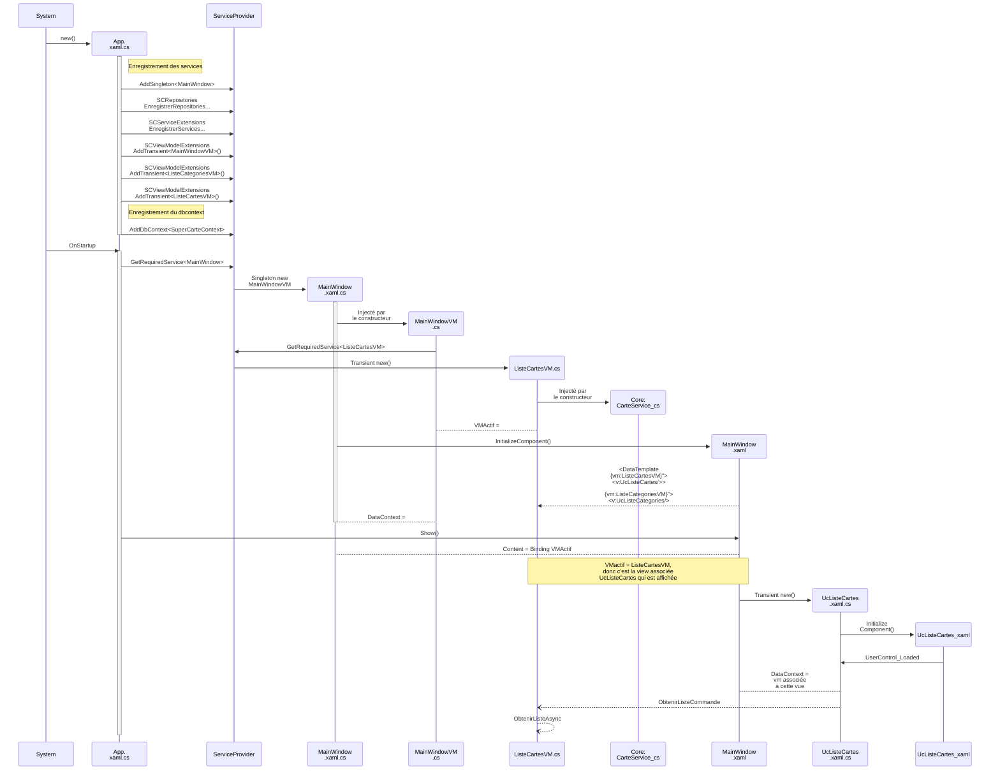

```mermaid
sequenceDiagram
    participant System

    create participant App_xaml_cs as App.<br>xaml.cs
    System->>App_xaml_cs: new()
    activate App_xaml_cs
    participant serv as ServiceProvider
    Note right of App_xaml_cs: Enregistrement des services
    App_xaml_cs->>serv: AddSingleton<MainWindow>
    App_xaml_cs->>serv: SCRepositories<br>EnregistrerRepositories...
    App_xaml_cs->>serv: SCServiceExtensions<br>EnregistrerServices...
    App_xaml_cs->>serv: SCViewModelExtensions <br/> AddTransient<MainWindowVM>()
    App_xaml_cs->>serv: SCViewModelExtensions <br/> AddTransient<ListeCategoriesVM>()
    App_xaml_cs->>serv: SCViewModelExtensions <br/> AddTransient<ListeCartesVM>()
    Note right of App_xaml_cs: Enregistrement du dbcontext
    App_xaml_cs->>serv: AddDbContext<SuperCarteContext>
    deactivate App_xaml_cs
    System->>App_xaml_cs: OnStartup
    activate App_xaml_cs
    App_xaml_cs->>serv: GetRequiredService<MainWindow>
    create participant MainWindow_xaml_cs as MainWindow<br>.xaml.cs
    serv->>MainWindow_xaml_cs: Singleton new<br/>MainWindowVM
    activate MainWindow_xaml_cs
    create participant MainWindowVM_cs as MainWindowVM<br>.cs 
    MainWindow_xaml_cs->>MainWindowVM_cs: Injecté par<br>le constructeur
    MainWindowVM_cs->>serv: GetRequiredService<ListeCartesVM>
    create participant ListeCartesVM_cs as ListeCartesVM.cs
    serv->>ListeCartesVM_cs: Transient new()
    create participant CarteService_cs as Core:<br>CarteService_cs
    ListeCartesVM_cs->>CarteService_cs: Injecté par<br>le constructeur
    MainWindowVM_cs-->ListeCartesVM_cs: VMActif =
    create participant MainWindow_xaml as MainWindow<br>.xaml
    MainWindow_xaml_cs->>MainWindow_xaml:InitializeComponent()
    MainWindow_xaml-->>ListeCartesVM_cs: <DataTemplate<br>{vm:ListeCartesVM}"><br><v:UcListeCartes/>><br><br>{vm:ListeCategoriesVM}"><br><v:UcListeCategories/>
    MainWindow_xaml_cs-->MainWindowVM_cs: DataContext =
    deactivate MainWindow_xaml_cs

    App_xaml_cs->>MainWindow_xaml: Show()
    MainWindow_xaml-->MainWindow_xaml_cs:Content = Binding VMActif
    Note over MainWindow_xaml,ListeCartesVM_cs: VMactif = ListeCartesVM, <br/> donc c'est la view associée<br/>UcListeCartes qui est affichée
    create participant UcListeCartes_xaml_cs as UcListeCartes<br>.xaml.cs
    MainWindow_xaml->>UcListeCartes_xaml_cs:Transient new()
    create participant UcListeCartes_xaml as UcListeCartes_xaml
    UcListeCartes_xaml_cs->>UcListeCartes_xaml:Initialize<br>Component()
    UcListeCartes_xaml->>UcListeCartes_xaml_cs: UserControl_Loaded
    UcListeCartes_xaml_cs-->MainWindow_xaml: DataContext =<br>vm associée <br>à cette vue 
    UcListeCartes_xaml_cs--)ListeCartesVM_cs:ObtenirListeCommande
    ListeCartesVM_cs--)ListeCartesVM_cs: ObtenirListeAsync


    deactivate App_xaml_cs

```
