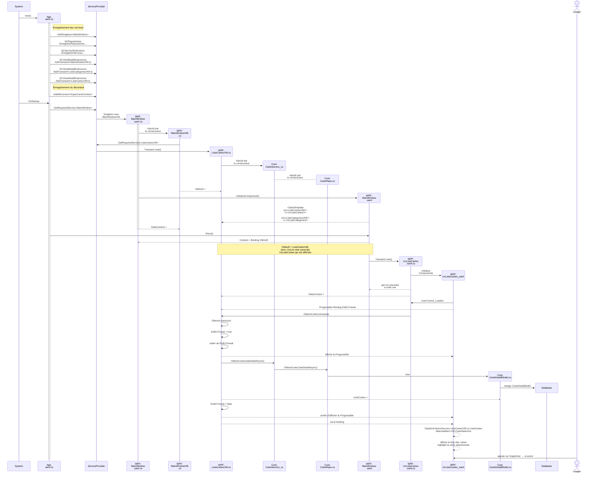

# Résumé de la partie 2

Pour ce diagramme en plus gros sur [Kroki!](https://kroki.io/mermaid/svg/eNqtV91u2zYUvs9TELvpAtTOveAISJOsCFCvRd26uQto6ljmIJEaSSnphr3LbrPX8IvtkJJtSqQcp1tukvCc7zv_h6KG32sQDG44zRUtzwj-VFQZznhFhSGL79pAeebOmQJqoCe-qqqHJ1oWD0wTqu2_09lKpfZoyrRDtQyTNPV0EyLg8edzJ6fM8MbyevLADQ2qsQYW-Jsz-KRkwzNQTu9XiWDF840hck16Vm6Fgpxro6AEZMlAOyZkaE14yuigFSXkKssWXOQFGClmc8rFNy4y-ZiOAhbXn6GSmhupOGgb_sGs8kXT6fQISRfa7ZMBobkUQ6ZO_gLLksPjXGZQHHgIEl2kNq4viuIRZsKLazlPu0L8J8IP6CRcYxlzF-r_y6qMz_iKetckWzEpDDyZY_W-WV23SrNFXYFyBruTtuwZjHZpvL0_ioVBlro63uIxf96D-YxDyRVkXcmDLowM4kHFn8dvn35JbBsdpPa_qT-e1ijaDvFYpt0Y2Gl11fHbph9ZiH_Z0-V81M3l3DmKYkcTsvdcdkQJuRO_ATPbZ2vOwgsgWHzshpoZqNWAyYGOZb3ffGPh9LQG8fRkg4QPcQnZt723HCMGHabzsbN3LRU4gwOZoxgaQtsDtdMyN-aK3XBRP6xgF_TA4mSS-tgfK93kPszhcn6FHbkmlyfOyQtDckrzucPkTnDDacH_wMVRVlJgGbsSDjQn0drPbqihX6CsCnTYmv-zKZOe2l8_pfZ81iRfmSe4SNvjPuSwhiOwnfAiHQtvch_MlvWvW4ldcr2dGBn-yHobpowsNvJxLEn3kYXk7GMNL8k7FOBy2pX7cC3IBtSQ7G2sTWjbJv3peNvdQZkUjLA3oA0pKGnwrsI-0ZLx7TM4jV4JCK4NYnXpes3ZBnXGmq8Hi-3pnkKwqodJStMoYXLiIgnBo6487IchajHqiTcSbiUMxiJOFNQ9ITkY0pSHAtgapdu_CQODATU1kKN8YfHDVg6xo7klX3F_W7SSxcMHSTPIxihitvHDNVeg9Tuq9k18q82twJo1lB_L8XnA9nGF48BVey7LkooM4is_xBIffKW_CzZ2WYRQ32EcIVzScDpY27Ip3B5h3AE-3lfdnAHBS8LP50jowWXXS5sV3oBBF1wSuuYcXlfn_dvqBIax27LVdJ--0UvTk_fuzs727vLu07jn1JhZ2-4rquHA1Qcj5U4lIWxDVQ6B2kh57qO--Kvx8oe7ak0LDa9rC6W2_2Dw2ZuuQdRpHTJC13Bq8at2SkeHPA62GX2veDa9w8eBXsha4cuNDL8Hk8G2X0CBX0GQWdAlanRtaA_xhfRKF_ZTgmFYoXv9sr2tDT6gCveIQgV3TPT2uTMldpcYXpNS4c6jOXTpa_8es1lVNUeiWhF8SVWKlwjDB-uU4MLWNW8UnB15UP0LLCXULg)

