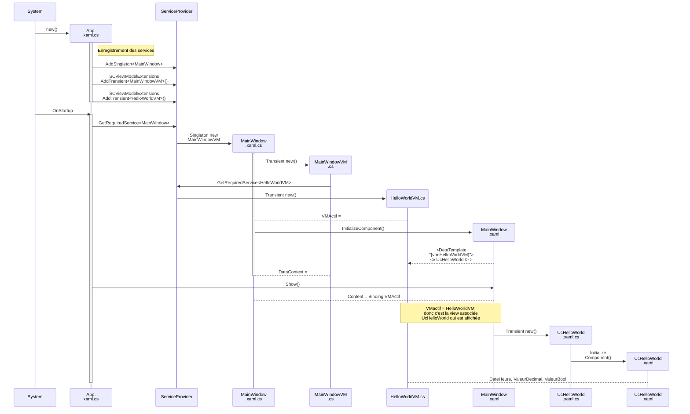

# Résumé HelloWorld

le constructeur de App.xaml.cs est appelé   
- C'est toujours App.xaml qui est appelé pour démarrer l'application. 
- crée le builder 
- configure les services
  - met la classe MainWindow en tant que service disponible en singleton
    - l'avantage de mettre MainWindow en tant que service c'est que chaque fois qu'on en demande une, c'est toujours la même qui sera utilisée (singleton)
    - étant donné qu'on ne prévoit pas en avoir besoin pour le testing, donc de le "mocker", on a pas besoin d'interface. Mais on pourrait le faire avec interface aussi. 
  - met SuperCarteContext en tant que context pour la bd
    - ce qui veut dire que si l'application demande un DbContext, c'est SuperCarteContext qui sera utilisé
    - va chercher la string de connection dans appsettings.json (DefaultConnection)
  - enregistre les services supplémentaires
    - les fonctions utilisées sont dans Extensions/ServiceCollections et sont dans des classes d'extensions de IServiceCollection
- Initialise le host
  - ce qui appel OnStartup

OnStartup est appelé par le host.Build()
- démarre le host
- va chercher le singleton MainWindow
- affiche la fenêtre

Constructeur de MainWindow.xaml
- Dans MainWindow.xaml.cs
  - recoit un MainWindowVM  (pas d'injection, c'est pas une interface)
  - Initialise MainWindow.xaml (InitializeComponent())
  - set le DataContext au MainWindowVM recu en argument
  
  
- Dans MainWindow.xaml: 
  - la première ligne indique c'est une Window, et que le code behing sera dans Supercarte.WPF.Mainwindow. C'est x:class qui indique ca. 
  - Le titre de la fenetre est set par Title=
  - Les caractérististique height, width, windowstate sont set
  - Dans la section DataTemplate
    - un DataTemplate sert a indique que si je veux afficher un HelloWorldVM, voici comme l'afficher. Ici, c'est en prenant la view UcHelloWorld. 
    - le vm (le quoi afficher) est set a HelloWorldVM
    - et la view (le comment l'afficher) est set a UcHelloWorld
  - Le Grid est le contenant dans lequel la sous-view sera affiché 
    - ici on indique d'utiliser celui qui est dans VMActif
      - VMActif provient du DataContext
        - Le DataContext est set dans le constructeur de MainWindow.xaml.cs
          - le DataContext est set à MainWindowVM (sous classe de BaseVM) qui a été créé dans le constructeur de MainWindow.xaml.cs
            - Dans MainWindowVM (qui est le DataContext) on déclare VMActif  
            - VMActif est set à HelloWorldVM, c'est donc la template pour afficher un HelloWorldVM qui sera affichée

Affichage de HelloWorldVM
- étant donné que VMActif indique d'afficher un HelloWorldVM, c'est la view UcHelloWorld qui sera affichée
  - UcHelloWorld.xaml.cs ne fait rien de spécial
  - UcHelloWorld.xaml affiche les 3 champs. 
  
  

## Liens

building a WPF application https://learn.microsoft.com/en-us/dotnet/desktop/wpf/app-development/building-a-wpf-application-wpf?view=netframeworkdesktop-4.8

code behind https://learn.microsoft.com/en-us/dotnet/desktop/wpf/advanced/code-behind-and-xaml-in-wpf?view=netframeworkdesktop-4.8
