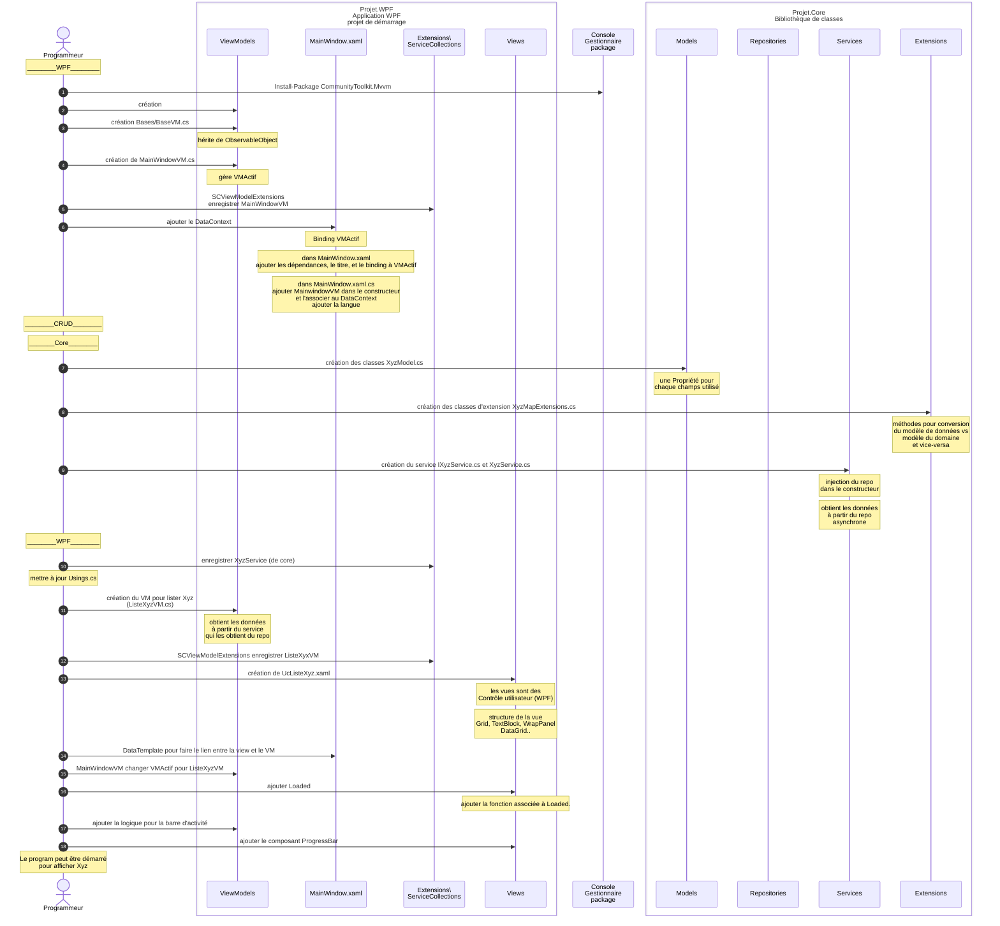

# Résumé du code

Ce diagramme synthétise le processus de développement vue jusqu'à maintenant. 

Ce diagramme sur [Kroki!](https://mermaid.ink/img/pako:eNqdV-tO4zgUfhUrfwCpdFsuA0QrpAF2VyNRDRpuq1WlkZuctobEzthOC4N4l_lJ9_e-QV5sz7ETmtIE7WyFGmKfy-dz-Y77FEQqhiAMDHzLQUZwJvhE83QoGX54bpXM0xHo8j2ySrNMqwnjhl3gE0VTyHHbC0hlgakZeKHwa_m5vfi9-tfL-e-ReiAjd2C7KPHrSB9_zLJERNwKJVm5lDkBFgOLi0XKteYT8Or0ybi2IhIZl5bNs_HXWUrIbgTMB3iuxLwn2b6XzsnKgAt5K2Ss5t0Hnibt4gb0jBR-e7AgDWI3wyFBv8R1EcGpShKIrFtvh4OQK-ilGMi4imtdOppkJHiK5lQC5OcPMGRdcqHde8aj-9coUSK2j49RK_wkjeVJsn3h99FEmuZS2McrpZJ7YbuDWRWVUssHKox0sXBJecXTvM1OuAHzC33fDLqReVsUpfy0WGiBa5jTzyMKHh8l8Hl0h0F63zwqLJPynodJ8aKB3Qw-YtjHazbJZXh5-loly7xR9EBqmAhjNZqre1szk85Dfqdyi3IJsDNuOebEwoNtAoXCJ2hIyMkqrDWpmMu10iNYS1eGOiHD6uDYr6ZDzq1AuB2GfYIvo9JP8eN_uMKY1r3R7rwMAHPy6CDCSFmdRxY730UM3W5wY1QkUIXn9VisQOf4Jyc5VGXUSBqsoorTL9dnS9p4V_ZUaVhlGOKWilxol3CciFEilJ0WL8h1VExRgqjBNPQY2UupNhwR1KhkTUpDpkjoCz6NQH4UrQYrnih5oU0Mo_aGTZZ0UO_oV4wrHWKqU7E_H7875A1tUtNluQQKVKZFsbDFgmXKZzWacgoTPtLMsNyKRJhisQ4B4bYAiDegOoMDw7PlmdpAkbUUgUwVWSIsVG64TVoEK84ZAi9eEpfBGGmvWKDkzDDafd3KcSvF4oWyQCng22SGr5_A8UHtCDkzPkPsE8Ius4WAqb9WFhpP4KwJeecpn6y5EnHYGxqo3YYaWQHS-o4vz0lWsK9dzejKtusx8yijqVbSNdfPTeO31MjqFLg8MNuklkF4W43mU7CoQKxzR1m7NshByzS3UnqOJOXzjPVlvUM60OY5veKL4_mtFqL_TzEqs0nr33LhZCu9MoI_MSJWglNifGiYDjTQV0fXdVQdqXafeHMiUnIAZzl-GUUQwZc2Eaou_sHy8b3IqXrYJmZzq9WUr7Jcu15B-kWr7sKgRdxhV9hrJ4mK7jvsVvPsgktwk4bYmyS63aaRR7tXkGYJ-vd5G9O9g8o6wZBieKgKyBfdaPxEagpPGtaHK9GMnCD0cmJ5y8sSYM3xrSbLueIxxK1hqA2gsZK-L_28wnqhivX6XdYEsz691EQQJ_py5WyE11EM7Qbei8VM2DfsuO6e2ifFMUFU727PYMwJ143tdA7uiRdslkFuWfE3xbW8AxcLd88jGHw8FtHU981QBp0gBY3EF-Od_okMDwM7hRSGQYj_xjDmeWKHwVA-oyjd7y-RN4IQ6wQ6QZ7FmNXyJ0AQjnlicBViGmsD_zvB_VzoBDitgvApeAjCfn-3u9fr7x7u7O192Dk86n3oBI9BuNs76Pb6vf7RzuFBv3e0e7D_3Am-K4Vm-9393lHvYG9_Z69_1EddZ-4vt0c4nv8FkSaE0w?type=png)