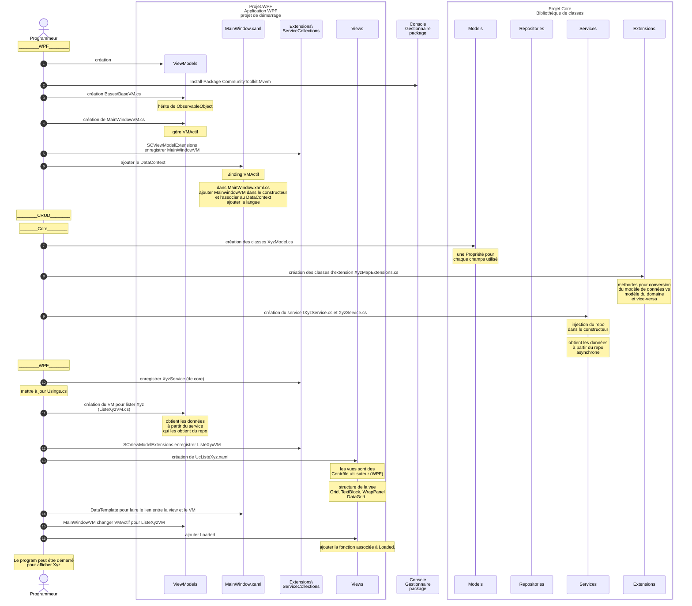

# Résumé du code

Ce diagramme synthétise le processus de développement vue jusqu'à maintenant. 

Ce diagramme sur [Kroki!](https://kroki.io/mermaid/svg/eNqVVstu2zgU3fcruGsCNJ69MQjQODODAjEatHl0MUBBU9cyHYpk-bCdfk2Xcdf9A_3Y3EtKtmzJQccwLEs8PDz3LQ_fImgB15KXjldvGH54DEbHagYu34pgHLPOlIx7dotXBFYQ3Zu0rE0AZlaQIeOvzefx9u_2b4IJBxyBlrsghbRcB7a286-rikgfJKynpgDlE5aILi4v8_pYuHrLgzQ6rc3MhjQsIYzwiD9n7vK9tUqKhGDNI5sArABW1NuKO8dLyMy94wcfV2tSNeVSP0pdmPVowys1iPTgVoT9axNAe5Tg_yUBn_GxFDAxSoEgZX74eLS7tT8jQBc9pCgtgSbIYhQQ_T_giVRz6dK95eKJTOx6D3eNP2gfuFIXt3kdKaoqahme74xRTzKMpqvWA8MuZ1fcg_-Dfh-mI-GPIt7AF_XWSXyG_v44I4_wmYKPsyWa_io54vc-foW_rF8csIfpe3Tl_JiRzht_nuxSaB8J8gxoB6X0wSFb96xjlmo95ksTA8IUsGseOLo7wCYMKELsFdJIXR5o6oEKrntJhDaSrPYsWl03kljC4-kCtQcXRcAaSzYEpt5y742QuIXHrrwumeL41WVs8mCoOllbk5NP99e7-nwNOTEODgqZCrCtQFokBVdypqQJi_oFuwmFVSjUC_2kF8RWUZhSgXVK_hjkwBrCfMKrl9iB5Cm6tgSbmjuBQl8d1ulhuTU1s5N3kKW-tYd9ef6eRPdTtbOVRQ3kIetkvQ31llmTAykWnPyDl8p6FoNU0tfbngCUeuL44i20-pMUbvf2nJBEZBXKWBgiIiWUX7hMm0hUERnKrl9UClyBXaXeInLlGa3uliIuVZit0GQkufqCaHhPf6rIjgGR-Rwa9gFFN2FCuQxpDh4M6U9kUi9zGyWylBlJ-UC9nKQwsyABk0GRGxsjiaT-kXPFtdSpovyzFgtnNJbS_xlyx22JddvP3lR2RiWC0s6HyCsIiGcobEnRuvfYaHbRPdlKI_aiHF5MqpCPI1PObugWb1J_PR9usL_lnCaI9PxblAnb7mtc9_ut-cAxjcJNvyvTfDycF_eitWc_k4_MoT1J3SrijzekD3I2U9N09S_MmVx8nFKGnWEYz08x5cyKLlUHdlgkTRPYyeIdu8PqulJGPL1jj47bW65B0So1aEKMRgNzhhbvoLIqvQ9RxOY0xymTFXoTXUPhp6Po7YCaP82-geh35xk1FV2i8GYiZeJ97Nmga9vJcWN4AcUpF3Tmy9zoXId5HGGeUJ7m7aPBiXMD6YqvjMxCDKz-SdY1r2X1Nr29kFQ-n0uxyHmbx1cqvf8ASHLIeg)