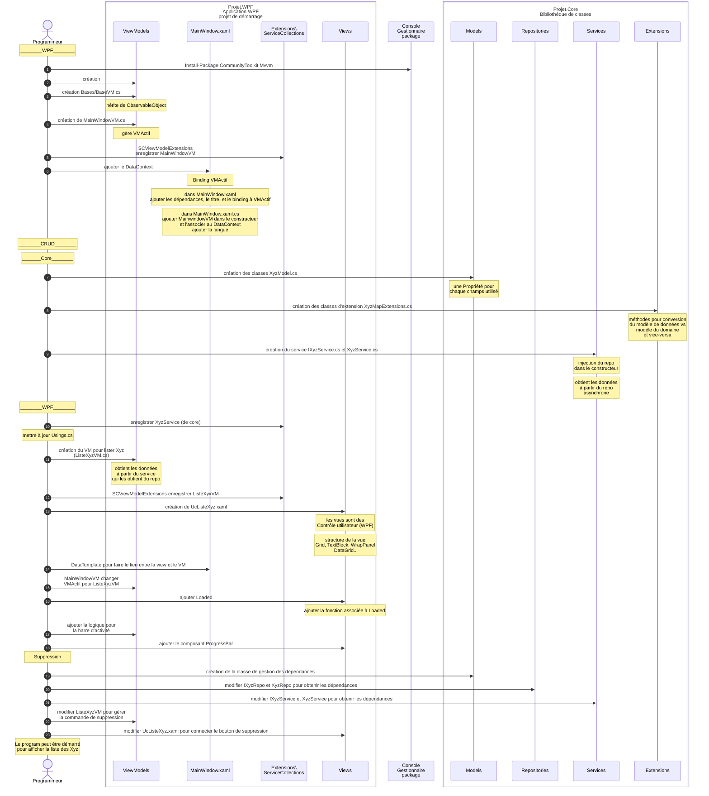

# Résumé du code

Ce diagramme synthétise le processus de développement vue jusqu'à maintenant. 

Ce diagramme sur [Kroki!](https://mermaid.ink/img/pako:eNqdV9tu4zYQ_RVCL0kAx819baEIsEnaYoEEG2xuRWFgQUtjm4lEaknKSTbIv_Qx7nP_QD_WGVKyZVtKuzUMyxKHh4dzOUO9BJGKIQgDA99ykBGcCT7WPB1Ihh-eWyXzdAi6vI-s0izTasy4YZd4RdMUchz2BlJZYGoK3ij8Wn7uLn-t_no7_ztUTwRyD7aLFj8P9fHHLEtExK1QkpWPMmfAYmBxMUu51nwMfjp9Mq6tiETGpWWP2ejrNCVmtwIeL3BfiXnPsn0sfSSUCy7knZCxeuw-8TRpNzegpzThlycL0iB3MxgQ9St8LiI4VUkCkXXP2-kg5Yp6aQYyrvxat47GGRmeIpxKgNb5DQyhSy60u8949DD3EgVi-_gYZ4WfpLE8SbYv_ThCpGkuhX2-Vip5ELZ7Ma28Us7yjgojXcxcUOZ8mofZCTdgfqLf24tuZFaTorSfFDMt8BnG9POQnMeHCXwe3qOT3ofHCYugvLfCuHjTwG4vPqLbR2uYtGR4dTrPkkXcyHsgNYyFsRrh6qutwaSPIb9XuUW7BNgZtxxjYuHJNpFC4xMEEnK8TGvNKuZyLfWI1mIpQ5WQYXZwrFfTocWtQLodhnWCN8NyneLP_7EU-rS-Go0-lg5gzh4XiNBTVueRxcp3HsNlN7gxKhI4hed1XyxR5_iV4xyqNGoUDVZJxemXm7OFbLxre6o0LCsMaUslLjRKPE7EMBHKToo31DpKpihB1mAaaozwUsoNJwQ1KVmz0pApMvqCVyNQH0UrYKUTpS60maHXVtRkIQf1ip5zXKoQU-2K_f783TFvKJPaXJZLIEdlWhQzW8xYpnxUowknN-ElzQzLrUiEKWbrFJBuC4F4A6o9ODI8W-ypjRShpUhkogiJuFC64TDNIlpxzpB48Za4CMYoe8UMLaeG0eh8KMehFJMXygQlh28TDF_fgdOD2hZyZnyE2CekXUYLCVN9LT1o3IFDE_LeSz6huRRx3BsKqB1DDa0AaX3Fl_skFKxrlzO6wnY1Zp5lNNFKuuL6sW68Ko2sLoGLDbNNKhmkt9UIn4LFCaQ69xS1G4MatAhzq6TnKFI-zphf1i9IG9o8p1u8cTq_1SL0_8lHZTTp-bdcONtqXunBH2gRS84pOT41dAdq6Mut6yaqtlQ7T6zsiCY5gtMcf4wiiuBTmwRVF39j-vha5JQ9bBOjudUK5bMs165WUH4R1R0YtIg77Bpr7SRR0UOH3WmeXXIJrtOQepNFt9vU8mj0GtIswfV93EZ07qC0TtCl6B7KAlqLTjS-IzW5Jw3rzZVkRo7BCU_ZtDz4IgtYs4ur5nKueAxxqydqPWikpC9N37IwZShp_fwua2Jab2BqLEgWHTlii8-GeCpFD2_g8VhMhV0RyXUKVEUpdgtSfHeIBmNOuG6sqqs8y2jcHb7-Xf2Jopdfuhn7g6FLofqZYR2JiiBEODGiFk6yR_2sFDz3120YywakWD-EsBZRXUKsZGRJRd_HbQrGHLOWGg5kjMdKmAcFXZxyGTs_mBYnzkMzx1yp0XkDkqjmPnRDRS9FjagroTsHd8VXJJZBblnxF1VG-RZTzNxJneD5aCSiSZletLqLF1IgHQ86QQoaO1mML2kvtM4gsBNIYRCE-DeGEc8TOwgG8hVN6YXtChtBEGLhQyfIsxjLtHynC8IRTww-hZjOKRf-xc-9_3UCPH4E4UvwFIS7h73u0cH-Xv9wr9fb6R32DzrBcxDuH-1393b6_f2dg91-f2-3_9oJviuFqLvdnZ0Pux_2-geHvV5vb_eo5-D-cIPE4_UfDQcxng?type=png)